# CoreInventory — Entity Relationship Diagram

## Full ER Diagram (Mermaid)

> **How to view**: Open this file in GitHub, VS Code (with Mermaid extension), or paste the code block into [mermaid.live](https://mermaid.live)

```mermaid
erDiagram

    %% ============================================================
    %% AUTHENTICATION MODULE
    %% ============================================================

    users {
        UUID id PK
        VARCHAR email UK
        VARCHAR username UK
        TEXT hashed_password
        VARCHAR full_name
        ENUM role "admin | manager | warehouse_staff | viewer"
        BOOLEAN is_active
        BOOLEAN is_deleted
        TIMESTAMPTZ created_at
        TIMESTAMPTZ updated_at
    }

    otp_verifications {
        UUID id PK
        UUID user_id FK
        VARCHAR otp_code
        VARCHAR purpose "login | password_reset"
        BOOLEAN is_used
        TIMESTAMPTZ expires_at
        TIMESTAMPTZ created_at
    }

    user_sessions {
        UUID id PK
        UUID user_id FK
        TEXT access_token UK
        TEXT refresh_token UK
        INET ip_address
        TEXT user_agent
        BOOLEAN is_active
        TIMESTAMPTZ expires_at
        TIMESTAMPTZ created_at
    }

    users ||--o{ otp_verifications : "has many"
    users ||--o{ user_sessions : "has many"

    %% ============================================================
    %% PRODUCT MANAGEMENT MODULE
    %% ============================================================

    product_categories {
        UUID id PK
        VARCHAR name UK
        TEXT description
        UUID parent_id FK "self-referencing tree"
        BOOLEAN is_deleted
        TIMESTAMPTZ created_at
        TIMESTAMPTZ updated_at
    }

    units_of_measure {
        UUID id PK
        VARCHAR name UK "Kilogram, Piece, Litre"
        VARCHAR symbol UK "kg, pcs, L"
        BOOLEAN is_deleted
        TIMESTAMPTZ created_at
    }

    products {
        UUID id PK
        VARCHAR sku UK
        VARCHAR name
        TEXT description
        UUID category_id FK
        UUID uom_id FK
        VARCHAR barcode UK
        NUMERIC weight
        NUMERIC cost_price
        NUMERIC sale_price
        TEXT image_url
        BOOLEAN is_active
        BOOLEAN is_deleted
        TIMESTAMPTZ created_at
        TIMESTAMPTZ updated_at
    }

    reorder_rules {
        UUID id PK
        UUID product_id FK
        UUID warehouse_id FK
        NUMERIC min_stock
        NUMERIC max_stock
        NUMERIC reorder_quantity
        BOOLEAN is_active
        TIMESTAMPTZ created_at
        TIMESTAMPTZ updated_at
    }

    product_categories ||--o{ product_categories : "parent-child"
    product_categories ||--o{ products : "categorizes"
    units_of_measure ||--o{ products : "measures"
    products ||--o{ reorder_rules : "has rules"

    %% ============================================================
    %% WAREHOUSE MANAGEMENT MODULE
    %% ============================================================

    warehouses {
        UUID id PK
        VARCHAR name UK
        VARCHAR code UK "WH-01"
        TEXT address
        VARCHAR city
        VARCHAR state
        VARCHAR country
        BOOLEAN is_active
        BOOLEAN is_deleted
        TIMESTAMPTZ created_at
        TIMESTAMPTZ updated_at
    }

    locations {
        UUID id PK
        UUID warehouse_id FK
        VARCHAR name "Rack A-01, Zone B"
        VARCHAR code UK "WH01-RA01"
        ENUM location_type "warehouse | rack | production | vendor | customer | adjustment"
        UUID parent_id FK "self-referencing hierarchy"
        BOOLEAN is_active
        BOOLEAN is_deleted
        TIMESTAMPTZ created_at
        TIMESTAMPTZ updated_at
    }

    warehouses ||--o{ locations : "contains"
    warehouses ||--o{ reorder_rules : "scoped to"
    locations ||--o{ locations : "parent-child"

    %% ============================================================
    %% RECEIPTS (Goods IN from Vendors)
    %% ============================================================

    receipts {
        UUID id PK
        VARCHAR reference UK "REC-000001"
        VARCHAR vendor_name
        UUID warehouse_id FK
        ENUM status "draft | confirmed | in_progress | done | cancelled"
        DATE scheduled_date
        TIMESTAMPTZ completed_date
        TEXT notes
        UUID created_by FK
        BOOLEAN is_deleted
        TIMESTAMPTZ created_at
        TIMESTAMPTZ updated_at
    }

    receipt_lines {
        UUID id PK
        UUID receipt_id FK
        UUID product_id FK
        UUID location_id FK
        NUMERIC quantity "must be greater than 0"
        NUMERIC received_qty
        UUID uom_id FK
        NUMERIC cost_price
        TEXT notes
        TIMESTAMPTZ created_at
    }

    warehouses ||--o{ receipts : "receives at"
    users ||--o{ receipts : "created by"
    receipts ||--o{ receipt_lines : "contains"
    products ||--o{ receipt_lines : "item"
    locations ||--o{ receipt_lines : "destination"
    units_of_measure ||--o{ receipt_lines : "unit"

    %% ============================================================
    %% DELIVERY ORDERS (Goods OUT to Customers)
    %% ============================================================

    delivery_orders {
        UUID id PK
        VARCHAR reference UK "DO-000001"
        VARCHAR customer_name
        UUID warehouse_id FK
        ENUM status "draft | confirmed | in_progress | done | cancelled"
        DATE scheduled_date
        TIMESTAMPTZ completed_date
        TEXT shipping_address
        TEXT notes
        UUID created_by FK
        BOOLEAN is_deleted
        TIMESTAMPTZ created_at
        TIMESTAMPTZ updated_at
    }

    delivery_order_lines {
        UUID id PK
        UUID delivery_order_id FK
        UUID product_id FK
        UUID location_id FK
        NUMERIC quantity "must be greater than 0"
        NUMERIC delivered_qty
        UUID uom_id FK
        NUMERIC sale_price
        TEXT notes
        TIMESTAMPTZ created_at
    }

    warehouses ||--o{ delivery_orders : "ships from"
    users ||--o{ delivery_orders : "created by"
    delivery_orders ||--o{ delivery_order_lines : "contains"
    products ||--o{ delivery_order_lines : "item"
    locations ||--o{ delivery_order_lines : "source"
    units_of_measure ||--o{ delivery_order_lines : "unit"

    %% ============================================================
    %% INTERNAL TRANSFERS
    %% ============================================================

    transfers {
        UUID id PK
        VARCHAR reference UK "TRF-000001"
        UUID source_warehouse_id FK
        UUID dest_warehouse_id FK
        ENUM status "draft | confirmed | in_progress | done | cancelled"
        DATE scheduled_date
        TIMESTAMPTZ completed_date
        TEXT notes
        UUID created_by FK
        BOOLEAN is_deleted
        TIMESTAMPTZ created_at
        TIMESTAMPTZ updated_at
    }

    transfer_lines {
        UUID id PK
        UUID transfer_id FK
        UUID product_id FK
        UUID from_location_id FK
        UUID to_location_id FK
        NUMERIC quantity "must be greater than 0"
        NUMERIC transferred_qty
        UUID uom_id FK
        TEXT notes
        TIMESTAMPTZ created_at
    }

    warehouses ||--o{ transfers : "source warehouse"
    users ||--o{ transfers : "created by"
    transfers ||--o{ transfer_lines : "contains"
    products ||--o{ transfer_lines : "item"
    locations ||--o{ transfer_lines : "from location"
    units_of_measure ||--o{ transfer_lines : "unit"

    %% ============================================================
    %% STOCK ADJUSTMENTS
    %% ============================================================

    stock_adjustments {
        UUID id PK
        VARCHAR reference UK "ADJ-000001"
        UUID warehouse_id FK
        ENUM reason "damaged | expired | cycle_count | initial_stock | other"
        ENUM status "draft | confirmed | in_progress | done | cancelled"
        TIMESTAMPTZ completed_date
        TEXT notes
        UUID created_by FK
        BOOLEAN is_deleted
        TIMESTAMPTZ created_at
        TIMESTAMPTZ updated_at
    }

    adjustment_lines {
        UUID id PK
        UUID adjustment_id FK
        UUID product_id FK
        UUID location_id FK
        NUMERIC counted_qty
        NUMERIC system_qty
        NUMERIC difference_qty "GENERATED: counted - system"
        UUID uom_id FK
        TEXT notes
        TIMESTAMPTZ created_at
    }

    warehouses ||--o{ stock_adjustments : "adjusted at"
    users ||--o{ stock_adjustments : "created by"
    stock_adjustments ||--o{ adjustment_lines : "contains"
    products ||--o{ adjustment_lines : "item"
    locations ||--o{ adjustment_lines : "location"
    units_of_measure ||--o{ adjustment_lines : "unit"

    %% ============================================================
    %% INVENTORY ENGINE (The Core Ledger)
    %% ============================================================

    stock_movements {
        UUID id PK
        UUID product_id FK
        UUID from_location_id FK "NULL = goods entering system"
        UUID to_location_id FK "NULL = goods leaving system"
        NUMERIC quantity "must be greater than 0"
        ENUM movement_type "RECEIPT | DELIVERY | INTERNAL_TRANSFER | ADJUSTMENT"
        VARCHAR reference_type "receipt | delivery | transfer | adjustment"
        UUID reference_id "points to source document"
        TEXT notes
        UUID created_by FK
        TIMESTAMPTZ created_at "IMMUTABLE - no updated_at"
    }

    stock_snapshots {
        UUID id PK
        UUID product_id FK
        UUID location_id FK
        NUMERIC quantity
        TIMESTAMPTZ snapshot_at
    }

    products ||--o{ stock_movements : "tracked"
    locations ||--o{ stock_movements : "from"
    locations ||--o{ stock_movements : "to"
    users ||--o{ stock_movements : "created by"
    products ||--o{ stock_snapshots : "cached stock"
    locations ||--o{ stock_snapshots : "at location"
```



---

## Module-wise Relationship Breakdown

### MODULE 1: Authentication

```
users ─────┬────── 1:N ──────► otp_verifications
            │                    (user_id → users.id)
            │
            └────── 1:N ──────► user_sessions
                                 (user_id → users.id)
```

- A **User** can have multiple OTP records and multiple active sessions
- `users.id` is referenced as `created_by` across ALL document tables and stock_movements

---

### MODULE 2: Product Management

```
product_categories ◄──── self-ref (parent_id)
        │
        │ 1:N
        ▼
    products ◄──── N:1 ──── units_of_measure
        │
        │ 1:N
        ▼
  reorder_rules ────► warehouses (scoped per warehouse)
```

- **Categories** are a tree: `Electronics → Sensors → Temperature Sensors`
- **Products** have NO stock column — stock is always derived
- **ReorderRule** has UNIQUE(product_id, warehouse_id) — one rule per product per warehouse

---

### MODULE 3: Warehouse Management

```
warehouses
    │
    │ 1:N
    ▼
locations ◄──── self-ref (parent_id)
    │
    │ Types: warehouse | rack | production | vendor | customer | adjustment
    │
    │ Virtual locations (vendor/customer/adjustment) represent
    │ "outside the system" for stock movement endpoints
```

- **Locations** are hierarchical: `Warehouse Zone A → Rack A-01 → Bin A-01-03`
- `vendor` and `customer` location types are virtual (for tracking origin/destination)

---

### MODULE 4: Inventory Operations (Document → Lines → Movements)

```
┌─────────────┐      ┌──────────────┐      ┌────────────────┐
│  RECEIPT     │──1:N─│ receipt_lines │──────│                │
│  (draft)     │      │              │      │                │
└──────────────┘      └──────────────┘      │                │
                                             │                │
┌──────────────┐      ┌──────────────┐      │                │
│  DELIVERY    │──1:N─│ delivery_    │──────│ stock_movements│
│  ORDER       │      │ order_lines  │      │ (IMMUTABLE)    │
└──────────────┘      └──────────────┘      │                │
                             ▲               │ from_location  │
┌──────────────┐      ┌──────────────┐      │ to_location    │
│  TRANSFER    │──1:N─│ transfer_    │──────│ quantity       │
│              │      │ lines        │      │ movement_type  │
└──────────────┘      └──────────────┘      │ reference_type │
                                             │ reference_id   │
┌──────────────┐      ┌──────────────┐      │                │
│  ADJUSTMENT  │──1:N─│ adjustment_  │──────│                │
│              │      │ lines        │      │                │
└──────────────┘      └──────────────┘      └────────────────┘
                                                     │
                                                     │ derived
                                                     ▼
                                             ┌────────────────┐
                                             │ stock_snapshots │
                                             │  (cache table)  │
                                             └────────────────┘
```

Every document links back via `reference_type` + `reference_id`:
- `reference_type = 'receipt'` + `reference_id = receipts.id`
- `reference_type = 'delivery'` + `reference_id = delivery_orders.id`
- `reference_type = 'transfer'` + `reference_id = transfers.id`
- `reference_type = 'adjustment'` + `reference_id = stock_adjustments.id`

---

### MODULE 5: Stock Derivation Logic

```
                        stock_movements table
                    ┌─────────────────────────────┐
                    │ product  │ from  │ to  │ qty │
                    ├──────────┼───────┼─────┼─────┤
  RECEIPT ────────► │ SKU-001  │ NULL  │ L1  │ 100 │  ← goods enter at L1
  RECEIPT ────────► │ SKU-001  │ NULL  │ L2  │  50 │  ← goods enter at L2
  DELIVERY ───────► │ SKU-001  │ L1    │ NULL│  30 │  ← goods leave from L1
  TRANSFER ───────► │ SKU-001  │ L1    │ L3  │  20 │  ← goods move L1 → L3
  ADJUSTMENT ─────► │ SKU-001  │ L2    │ NULL│   5 │  ← 5 units lost at L2
                    └──────────┴───────┴─────┴─────┘

  Current stock for SKU-001:
  ┌──────────┬──────────────────────────────┬───────┐
  │ Location │ Calculation                  │ Stock │
  ├──────────┼──────────────────────────────┼───────┤
  │ L1       │ +100 -30 -20                 │   50  │
  │ L2       │ +50 -5                       │   45  │
  │ L3       │ +20                          │   20  │
  ├──────────┼──────────────────────────────┼───────┤
  │ TOTAL    │                              │  115  │
  └──────────┴──────────────────────────────┴───────┘

  Formula: SUM(to_qty) - SUM(from_qty) per product per location
```

---

### Movement Type Rules

| Movement Type | from_location_id | to_location_id | Effect |
|---|---|---|---|
| `RECEIPT` | `NULL` | destination location | Stock **increases** at destination |
| `DELIVERY` | source location | `NULL` | Stock **decreases** at source |
| `INTERNAL_TRANSFER` | source location | destination location | Stock **moves** between locations |
| `ADJUSTMENT (+)` | `NULL` | location | Stock **increases** (found extra) |
| `ADJUSTMENT (-)` | location | `NULL` | Stock **decreases** (lost/damaged) |

---

### SQL Views (Pre-built Queries)

| View | Aggregation Level | Purpose |
|---|---|---|
| `v_current_stock` | Product + Location | On-hand qty per product per physical location |
| `v_warehouse_stock` | Product + Warehouse | Summed across all locations in a warehouse |
| `v_global_stock` | Product (global) | Total across all warehouses |
| `v_low_stock_alerts` | Product + Warehouse | Join with reorder_rules to flag low stock |
